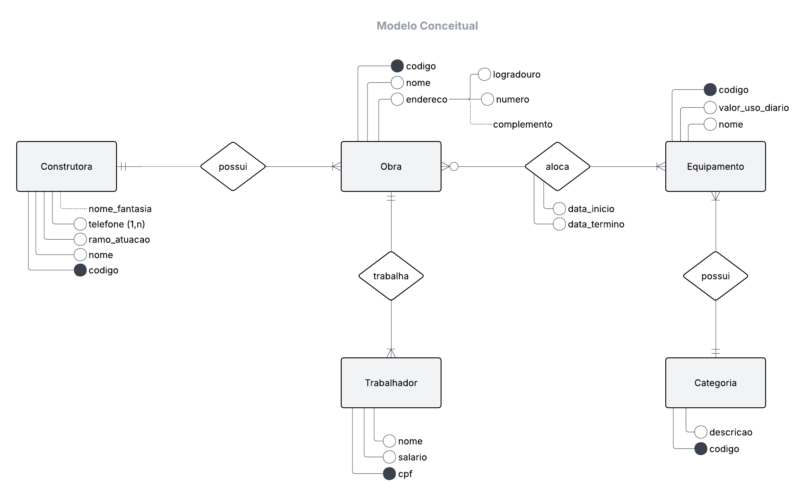
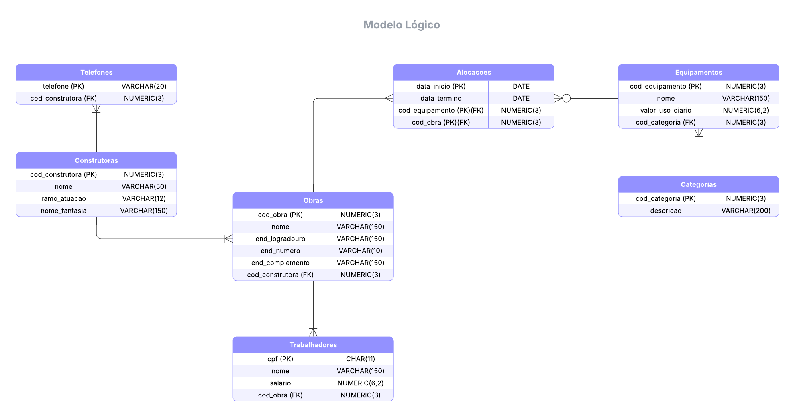
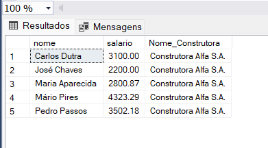
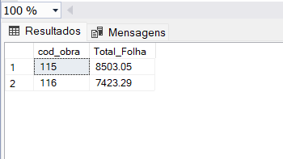
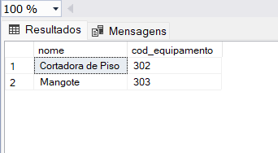
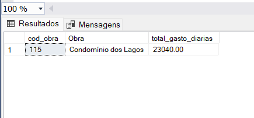

# Banco de Dados para Construtoras

Projeto de modelagem e implementação de um banco de dados voltado ao contexto de construtoras, com foco na organização e integração de informações sobre obras, trabalhadores, equipamentos e suas alocações.

## Contexto do Negócio

Um conglomerado de construtoras deseja gerir suas obras e seus recursos, permitindo o controle de informações relacionadas a construtoras, trabalhadores, obras, equipamentos e categorias.
Cada construtora possui código, nome, um ou mais telefones e, opcionalmente, um nome fantasia. As construtoras são responsáveis por múltiplas obras.
As obras possuem código, nome e endereço (logradouro, número e complemento opcional), sendo o local onde os trabalhadores e equipamentos são alocados.
Os trabalhadores possuem CPF, nome e salário, e cada trabalhador está associado a uma única obra.
Os equipamentos possuem código, nome e valor de uso diário, podendo ser alocados em uma ou mais obras ao longo do tempo. Para cada alocação, são registradas as datas de início e término de uso.
Cada equipamento pertence a uma categoria, sendo que cada categoria possui código e descrição.

## Conceitual - DER

## Lógico - DER

## Dicionário de Dados

- **Construtoras**

| Campo           | Descrição                                                   |
|-----------------|-------------------------------------------------------------|
| cod_construtora | Identificador único da construtora                          |
| nome            | Nome da construtora                                         |
| nome_fantasia   | Nome fantasia da construtora                                |
| ramo_atuacao    | Ramo de atuação da construtora (Residencial ou Comercial)   |

- **Telefones**

| Campo           | Descrição                             |
|-----------------|---------------------------------------|
| telefone        | Telefone de contato da construtora    |
| cod_construtora | Identificador único da construtora    |

- **Obras**

| Campo            | Descrição                            |
|------------------|--------------------------------------|
| cod_obra         | Identificador único da obra          |
| nome             | Nome da obra                         |
| end_logradouro   | Logradouro da obra                   |
| end_numero       | Número do endereço da obra           |
| end_complemento  | Complemento do endereço da obra      |
| cod_construtora  | Identificador único da construtora   |

- **Trabalhadores**

| Campo            | Descrição                                 |
|------------------|-------------------------------------------|
| cpf              | Identificado único do trabalhador (CPF)   |
| nome             | Nome do trabalhador                       |
| salario          | Salário (R$) do trabalhador               | 
| cod_obra         | Identificador único da obra               |

- **Equipamentos**

| Campo            | Descrição                            |
|------------------|--------------------------------------|
| cod_equipamento  | Identificador único do equipamento   |
| nome             | Nome do equipamento                  |
| valor_uso_diario | Valor de uso diário do equipamento   |
| cod_categoria    | Código da categoria do equipamento   |

- **Categorias**

| Campo            | Descrição                            |
|------------------|--------------------------------------|
| cod_categoria    | Código da categoria do equipamento   |
| descricao        | Descrição do tipo de equipamento     |

- **Alocações**

| Campo            | Descrição                                  |
|------------------|--------------------------------------------|
| cod_obra         | Identificador único da obra                |
| cod_equipamento  | Identificador único do equipamento         |
| data_inicio      | Data de início da alocação do equipamento  |
| data_termino     | Data de término da alocação do equipamento |

## Consultas realizadas

- Seleção de nomes e salários dos trabalhadores da construtora ALFA, ordenados em ordem alfabética crescente.

- Cálculo da folha de pagamento por obra.

- Identificação de equipamentos que nunca foram utilizados em obras.

- Cálculo do total gasto com diárias de equipamentos na obra "Condomínio dos Lagos" no mês de março de 2022.

## Geração de JSON

Foi desenvolvida uma consulta SQL para consolidar e estruturar os dados em formato JSON.

## Tecnologias

- SQL Server Express
- SQL Server Management Studio (SSMS)
- Lucidchart

## Sobre o Projeto

Primeiro projeto de modelagem e implementação de um banco de dados, desenvolvido no contexto acadêmico em junho de 2025.

## Fonte dos Dados

Os dados utilizados neste projeto foram fornecidos pela instituição de ensino no contexto da disciplina.